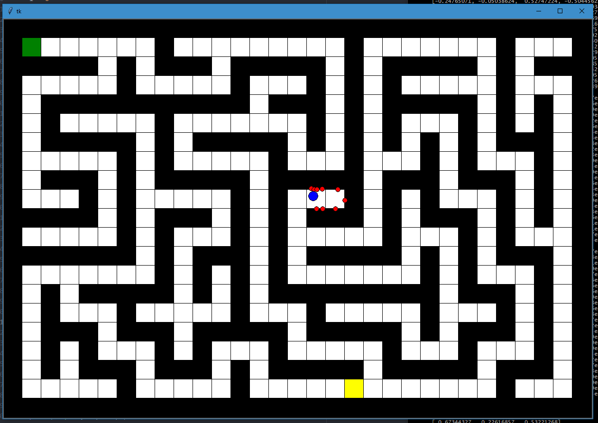

# K2017 : Autonomous car driving using Neural Network

## Screenshot



## Getting started

- Clone
- Install dependencies with pip if needed (when running)
- Optional : ```python app.py``` (to train NN)
- ```python app.py AI``` (to use saved data)
